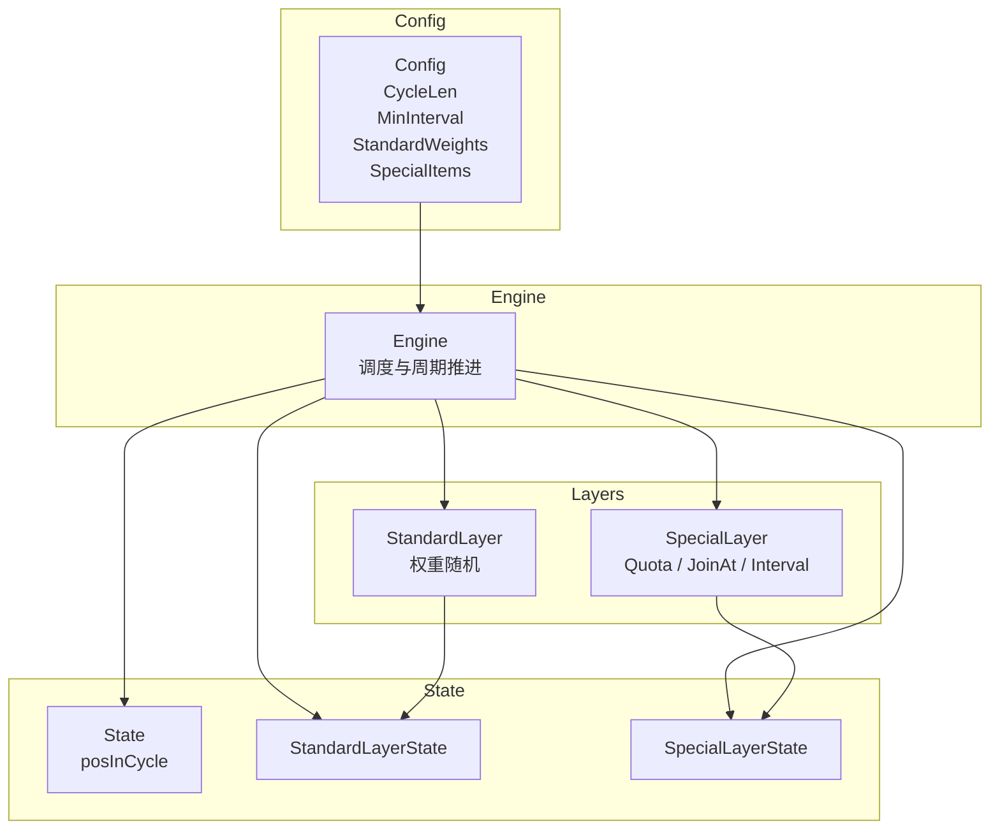
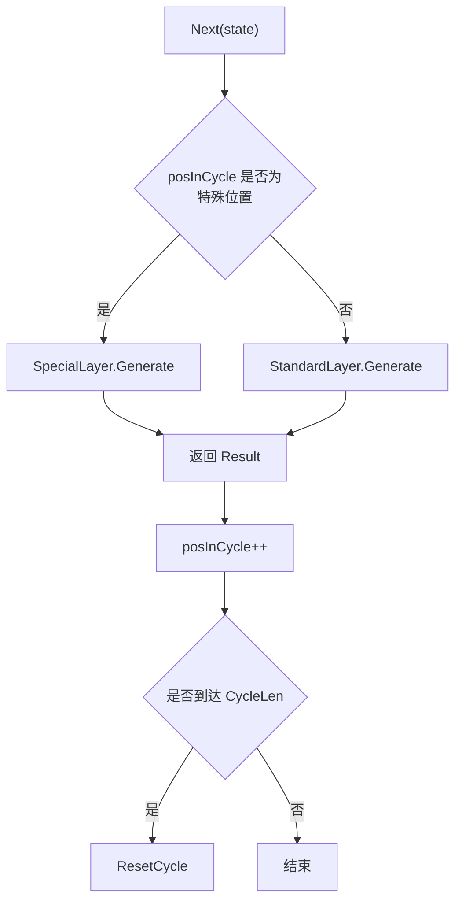
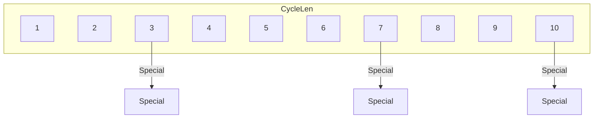
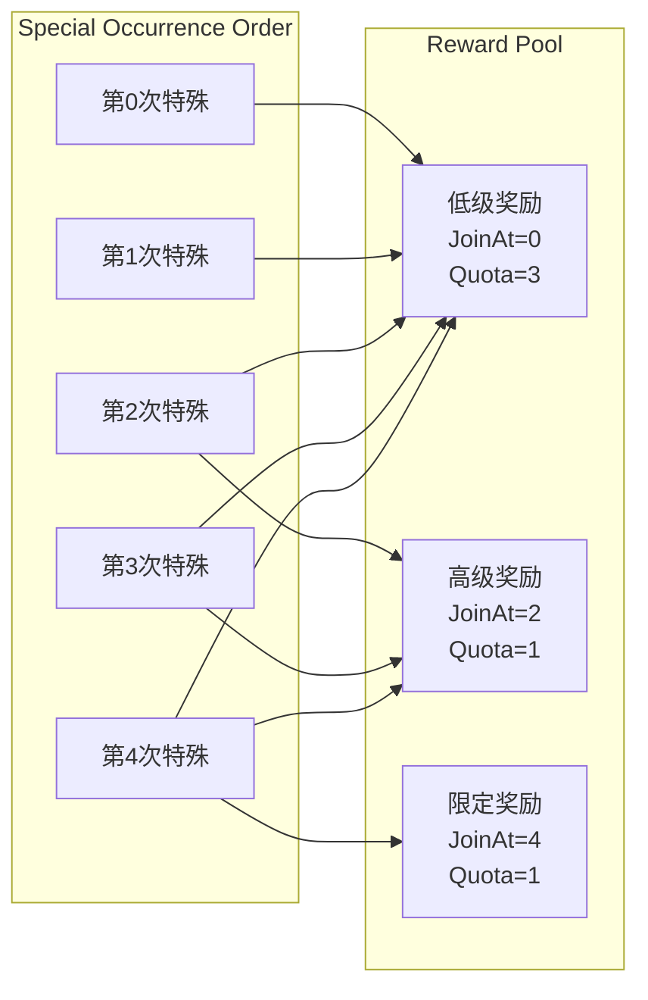

Package tiered_cycle 实现"分层周期分布"（Tiered Cycle Distribution）。

## 概念模型

分层周期分布将游戏抽卡（Gacha）等场景中的"保底机制"抽象为通用分布模型：

  - 一个"大周期"由 CycleLen 次抽取组成。
  - 每个大周期内固定包含 sum(items[i].Quota) 次"特殊抽"，
    剩余 CycleLen - sum(items[i].Quota) 次为"标准抽"。
  - 特殊抽的位置在每轮周期开始时随机生成（受 MinInterval 最小间隔约束），
    兼顾随机性与均匀分布。
  - 标准抽走权重随机；特殊抽在满足 JoinAt 门槛且 Quota 未耗尽的候选集合中按剩余配额加权随机。

## 参数说明

  - CycleLen：大周期长度，即一个保底周期的总抽次数。
  - MinInterval：两个特殊位置之间的最小间隔（以抽次计），0 表示不限。
  - SpecialItem.Quota：该奖励在一个周期内最多出现的次数。
  - SpecialItem.JoinAt：第几次特殊抽（0-based 特殊出现序号）时该奖励才开始进入候选池。
    这是静态配置，与奖励在大周期内的绝对位置无关；每轮动态生成的特殊分布计划
    决定"第几次特殊抽对应哪个绝对位置"，二者相互独立。
    例：JoinAt=0 → 从第0次特殊抽起即可出现；JoinAt=4 → 从第5次特殊抽起才能出现。

## Engine 与 State 的职责分离

  - Engine 保存不可变规则（Config），可被多个玩家/对象共享，但**非 goroutine-safe**（持有 `*rand.Rand`，多 goroutine 并发调用需加锁）。
  - State 保存单个玩家/对象的进度（当前位置、周期计划、已用配额），互相独立，**非 goroutine-safe**，不得跨 goroutine 共享。
  - 使用 Engine.Init(state) 初始化一个新 State。
  - 使用 Engine.Next(state) 推进一次抽取。
  - 使用 Engine.ResetCycle(state) 或 Engine.NextAutoReset(state) 管理周期重置。

## 典型场景

游戏抽卡保底：100 抽为一个大周期，10 个保底位置随机分布在其中；
早期保底只出低星奖励，后期保底逐步解锁高星限定奖励，周期末的最后一次保底必出最高级奖励。

## 架构结构

说明：

•	Config：不可变规则

•	Engine：负责周期推进与层调度

•	State：保存玩家进度

•	Layers：实现具体算法

## 执行流程图

含义：
1.	Engine 推进 posInCycle
2.	判断当前位置是否是 特殊位置
3.	调用对应 Layer
4.	返回结果
5.	周期结束则 Reset
## 周期分布示意图

解释：
•	一个周期内有 固定数量的 Special

•	位置随机生成

•	受 MinInterval 控制

## 特殊层解锁示意（JoinAt + Quota）

在特殊层中，不同奖励可以按照“特殊出现序号”逐步解锁。  
`JoinAt` 控制奖励从第几次 **特殊抽** 开始进入候选池，而 `Quota` 控制一个周期内最多出现次数。

说明：

- `JoinAt` 决定奖励 **何时开始加入候选池**
- `Quota` 决定奖励 **一个周期最多出现多少次**
- 每次特殊抽会在 **当前已解锁奖励集合** 中按照剩余 `Quota` 加权随机选择

这种设计允许实现典型的游戏机制，例如：

- 早期保底只出低级奖励
- 中期开始加入高级奖励
- 周期末解锁限定奖励
- 周期结束后重新生成新的特殊分布计划